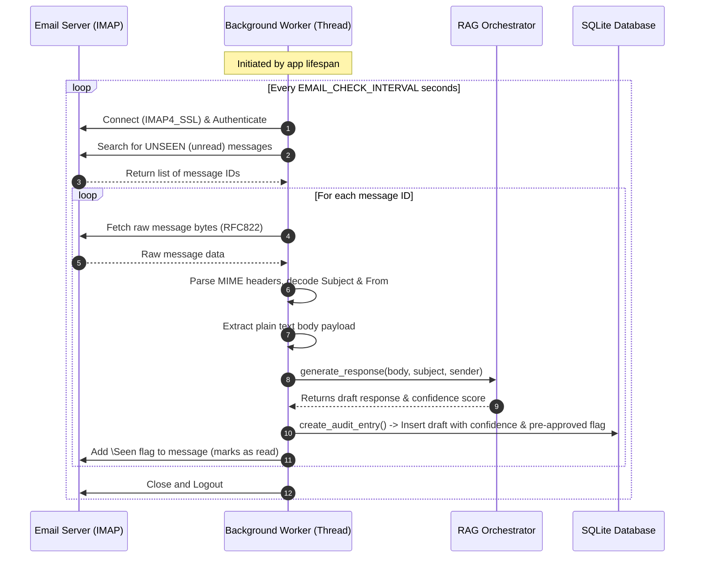
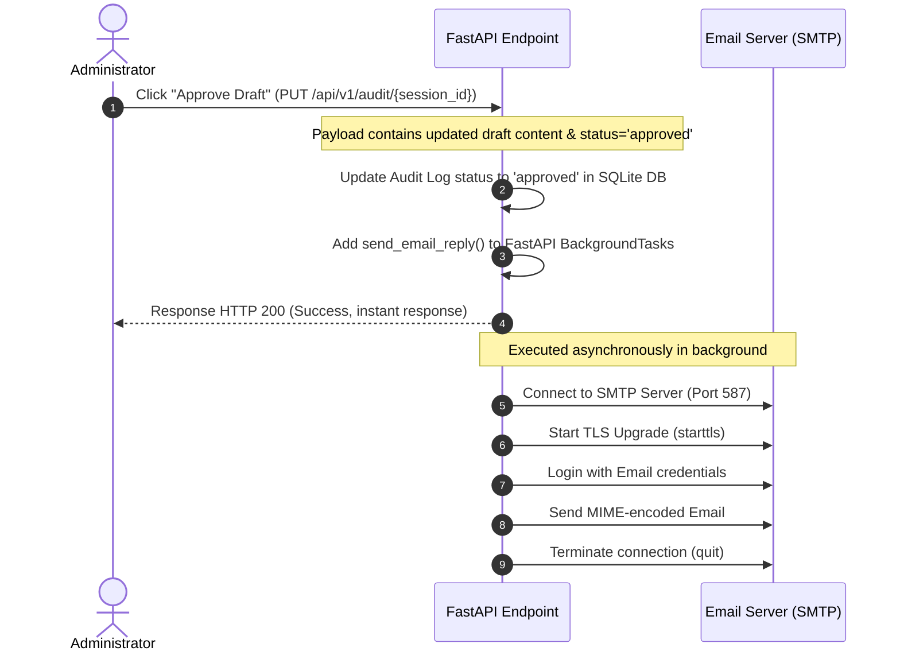

# Technical Guide: IMAP & SMTP Email Integration
**ITE AI-Powered Administrative Ticket & Email Copilot**

This document details the architectural design, sequence flows, and implementation details of the email processing components (IMAP and SMTP) in the ITE Copilot project. It is structured to help you understand the codebase thoroughly and prepare for technical presentations or reviews.

---

## 1. High-Level Architecture Overview

The email system is split into two distinct responsibilities to ensure performance and prevent blocking the web server:
1. **Inbound Processing (IMAP)**: Done via a persistent background daemon thread that periodically polls the inbox.
2. **Outbound Processing (SMTP)**: Done on-demand via FastAPI `BackgroundTasks` when an administrator approves a draft.

```
       +-------------------+             +-----------------------+
       |   Email Server    |             |  FastAPI Application  |
       |                   |             |                       |
       |  [INBOX]          | --(IMAP)--> | [Email Worker Thread] | --> [RAG Pipeline] --> [SQLite DB]
       |                   |             |                       |
       |  [SEND MAIL]      | <--(SMTP)-- | [Background Tasks]    | <-- [Admin Approval API]
       +-------------------+             +-----------------------+
```

---

## 2. Inbound Email Processing (IMAP)

The polling logic resides in [`app/core/email_worker.py`](file:///c:/Users/ianon/ITE%20PROJECT/PROJECTFOLDER/app/core/email_worker.py). It runs continuously in the background as long as the FastAPI server is active.

### Sequence Flow Diagram



### Detailed Component Walkthrough
*   **Startup & Lifespan**: When the FastAPI application starts, the lifespan handler in [`app/main.py`](file:///c:/Users/ianon/ITE%20PROJECT/PROJECTFOLDER/app/main.py#L11-L18) calls [`start_email_worker`](file:///c:/Users/ianon/ITE%20PROJECT/PROJECTFOLDER/app/core/email_worker.py#L149). This initializes a dedicated daemon thread to run the polling loop:
    ```python
    _worker_thread = threading.Thread(target=_worker_loop, daemon=True)
    ```
*   **SSL Connection**: [`check_and_process_emails`](file:///c:/Users/ianon/ITE%20PROJECT/PROJECTFOLDER/app/core/email_worker.py#L57) establishes a secure connection to the IMAP server using Python's standard `imaplib.IMAP4_SSL` module.
*   **MIME Extraction**: Raw emails arrive in complex nested formats (MIME). [`get_email_body`](file:///c:/Users/ianon/ITE%20PROJECT/PROJECTFOLDER/app/core/email_worker.py#L16) recursively searches through multipart formats to extract only plain text (`text/plain`), ignoring HTML formatting and attachment headers.
*   **Preventing Duplicate Processing**: To ensure an email is only processed once, the worker executes `mail.store(e_id, "+FLAGS", "\\Seen")` immediately after generating the draft, marking the email as read on the mail server.

---

## 3. Outbound Email Replying (SMTP)

The outgoing email logic is defined in [`app/core/email_sender.py`](file:///c:/Users/ianon/ITE%20PROJECT/PROJECTFOLDER/app/core/email_sender.py) and is triggered through the audit API endpoint in [`app/api/v1/endpoints/audit.py`](file:///c:/Users/ianon/ITE%20PROJECT/PROJECTFOLDER/app/api/v1/endpoints/audit.py).

### Sequence Flow Diagram



### Detailed Component Walkthrough
*   **Non-Blocking API Calls**: Network-bound calls to SMTP servers can easily take 1–3 seconds due to SSL/TLS handshakes and logins. To avoid blocking the UI, the PUT endpoint in [`app/api/v1/endpoints/audit.py`](file:///c:/Users/ianon/ITE%20PROJECT/PROJECTFOLDER/app/api/v1/endpoints/audit.py#L41) adds the sending function to `BackgroundTasks`:
    ```python
    background_tasks.add_task(send_email_reply, recipient, subject, body)
    ```
*   **SMTP Connection Upgrade**: [`send_email_reply`](file:///c:/Users/ianon/ITE%20PROJECT/PROJECTFOLDER/app/core/email_sender.py#L6) establishes a connection over port `587` and executes `.starttls()`. This upgrades the plain TCP connection to an encrypted TLS connection before sending the user login credentials, protecting them from interception.
*   **MIME Construction**: The code constructs a `MIMEMultipart` mail container to hold headers like `From`, `To`, and `Subject` (prepending `"RE:"` to group the message inside the recipient's mail client threads), attaching the body content encoded in `utf-8`.

---

## 4. Configuration & Settings

Both services rely on configurations defined in [`app/config.py`](file:///c:/Users/ianon/ITE%20PROJECT/PROJECTFOLDER/app/config.py), which automatically binds environment variables from the [`.env`](file:///c:/Users/ianon/ITE%20PROJECT/PROJECTFOLDER/.env) file:

| Variable | Default Value | Description |
| :--- | :--- | :--- |
| `EMAIL_IMAP_SERVER` | `outlook.office365.com` | Hostname of the incoming mail server. |
| `EMAIL_SMTP_SERVER` | `smtp.office365.com` | Hostname of the outgoing mail server. |
| `EMAIL_IMAP_PORT` | `993` | Secure IMAP SSL port. |
| `EMAIL_SMTP_PORT` | `587` | Outgoing SMTP port with STARTTLS support. |
| `EMAIL_ADDRESS` | *None* | Username/email address for authenticating. |
| `EMAIL_PASSWORD` | *None* | Password/App Password for authenticating. |
| `EMAIL_CHECK_INTERVAL` | `30` | Number of seconds to sleep between folder polls. |

---

## 5. Potential Lecturer Q&A (Preparation Questions)

### Q1: Why did you use Python's built-in `threading.Thread` instead of `asyncio` for the email worker?
> **Answer**: Python’s standard library `imaplib` is entirely synchronous and blocking. If we attempted to run it directly inside an asynchronous loop (like FastAPI's event loop), it would block the entire web application and prevent the API from serving other incoming requests. Running the polling loop inside a dedicated background thread ensures that the web server remains fully responsive.

### Q2: How does the application handle HTML emails?
> **Answer**: In [`get_email_body`](file:///c:/Users/ianon/ITE%20PROJECT/PROJECTFOLDER/app/core/email_worker.py#L16), we check if the incoming email contains multiple parts (`msg.is_multipart()`). We walk through each part and isolate the `text/plain` section, while filtering out attachments or HTML-specific structures. This returns clean, raw text to the RAG orchestrator, which is optimal for generating replies.

### Q3: What happens if the SMTP server goes down or fails during dispatch?
> **Answer**: The connection and authentication attempts in [`send_email_reply`](file:///c:/Users/ianon/ITE%20PROJECT/PROJECTFOLDER/app/core/email_sender.py#L32-L36) are wrapped inside a try-except block. If a failure occurs, the exception is caught, logged to the server stdout/logs, and the function returns `False`. Since it runs in a background task, the error is isolated and doesn't crash the web server.

### Q4: Why did you use `BackgroundTasks` in FastAPI instead of an active queue system like Celery?
> **Answer**: Celery is a robust, distributed task queue, but it introduces heavy external dependencies like Redis or RabbitMQ, which increases operational and deployment complexity. For this system's scale, FastAPI's built-in `BackgroundTasks` is lightweight and fits our design principle of simplicity by operating inside the same ASGI process without additional infrastructure.

### Q5: How do you prevent the server from fetching and replying to the same email multiple times?
> **Answer**: We perform two safeguard checks:
> 1. We query only `UNSEEN` emails.
> 2. Once an email is fetched and processed, we immediately set the `\Seen` flag on the email server. The next polling query (30 seconds later) will not see this email again. Additionally, the generated draft in our local database gets a unique `session_id` to prevent redundant records.
