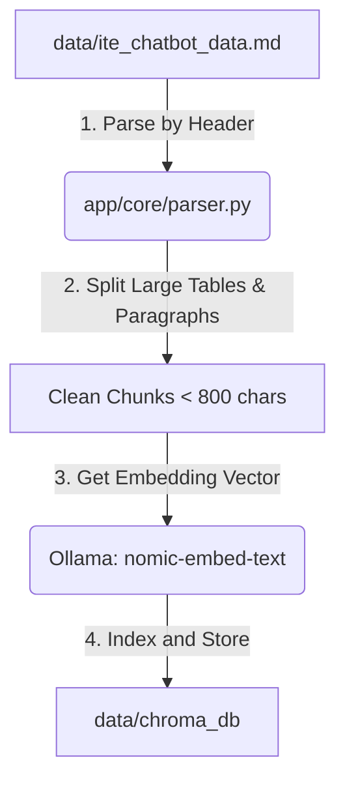
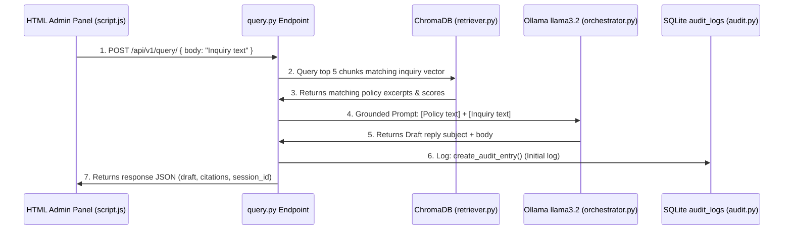
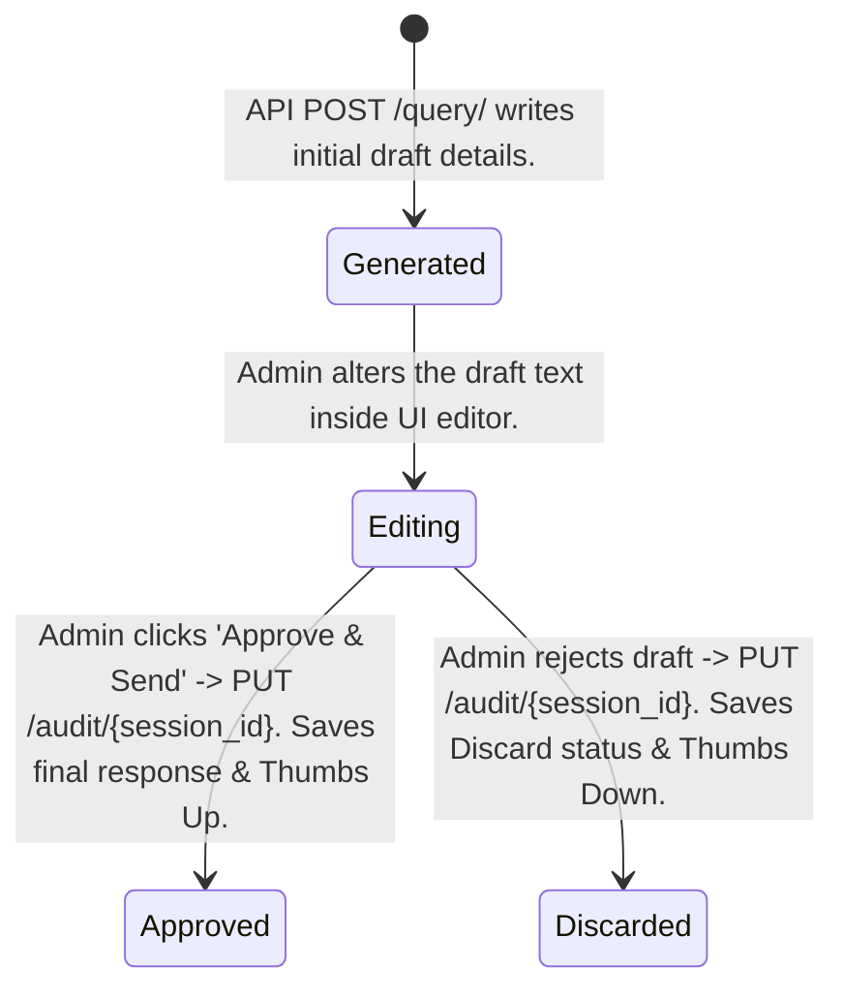

# ITE Ticket & Email Copilot — Technical Architecture & Study Guide

This document is a comprehensive guide to help you understand the internal architecture, file responsibilities, data flows, and third-party libraries of the **ITE Ticket & Email Copilot** backend. It is structured to help you defend and present your capstone project with confidence.

---

## 1. Core Concepts (Explained Simply)

*   **FastAPI**: A modern, high-performance web framework for Python used to build RESTful APIs. It automatically parses incoming JSON requests, validates inputs using Pydantic, and generates interactive documentation (Swagger) at `/docs`.
*   **Retrieval-Augmented Generation (RAG)**: Standard AI models are trained on public data and do not know internal ITE policies. Instead of retraining a model (which is expensive), RAG retrieves the exact official policy documents matching a student's inquiry, inserts them as context into the prompt, and directs the LLM to draft an email strictly grounded in that retrieved text.
*   **Embeddings**: A method of converting human text (words/sentences) into a long list of numbers (a vector). These numbers represent the semantic meaning of the text. Conceptually, *"How much is school fee?"* and *"Tuition costs"* will generate vectors that are geometrically close in mathematical space, enabling search by meaning rather than exact keyword matches.
*   **Vector Database (ChromaDB)**: A database specialized in storing these embedding vectors. It calculates the cosine similarity (distance) between a query vector and the document vectors to find the most relevant chunks in milliseconds.
*   **Audit Trail & SQLite**: A local SQL database (`audit_log.db`) used to track AI performance. It logs what the AI generated, what the human edited, and what rating feedback the human provided, ensuring accountability (Human-in-the-Loop).

---

## 2. Directory & File Breakdown

Here is what every file in the project does and why it exists:

```text
PROJECTFOLDER/
│
├── app/
│   ├── main.py                     # FastAPI entry point. Mounts router and static UI folder.
│   ├── config.py                   # Loads environment variables (.env) using Pydantic Settings.
│   │
│   ├── api/
│   │   ├── router.py               # Root API router (maps prefix /api).
│   │   └── v1/
│   │       ├── router.py           # v1 API router (groups health, query, and audit).
│   │       └── endpoints/
│   │           ├── health.py       # Basic API heartbeat status endpoint.
│   │           ├── query.py        # Runs the RAG pipeline to generate response drafts.
│   │           └── audit.py        # Logs admin actions, corrections, and feedback to SQLite.
│   │
│   └── core/
│       ├── parser.py               # Reads the raw markdown data and slices it into search chunks.
│       ├── embedder.py             # Generates vector embeddings and indexes chunks in ChromaDB.
│       ├── retriever.py            # Queries ChromaDB to find matching context for a question.
│       ├── orchestrator.py         # Formulates prompts and calls the Ollama llama3.2 model.
│       └── audit.py                # Performs SQL insert/update operations on the SQLite database.
│
├── data/
│   ├── ite_chatbot_data.md         # The main scraped database of policies, handbooks, and FAQs.
│   ├── ite_chatbot_data_test.md    # A smaller sample file used for running chunking unit tests.
│   ├── chroma_db/                  # Persistent database directory storing HNSW vector indexes.
│   └── audit_log.db                # SQLite database storing human review drafts and ratings.
│
├── tests/
│   ├── test_parser.py              # Validates that the chunker parses text without limits errors.
│   ├── test_retriever.py           # Asserts retrieval relevance for key test queries.
│   ├── test_api.py                 # Tests CRUD and lifecycle endpoints (/health, /query, /audit).
│   └── test_integration_live.py    # Tests live RAG pipeline interactions.
│
├── .env                            # App environment configurations (port keys, debug flags).
└── requirements.txt                # Lists the python libraries required to run the project.
```

---

## 3. Libraries Used

*   **`fastapi` & `uvicorn`**: Web framework and local dev server.
*   **`pydantic`**: Data validation library. Validates schema structures for request/response payloads.
*   **`chromadb`**: Vector store for fast semantic document retrieval.
*   **`ollama`**: Coordinates connections to the local Ollama daemon for embeddings (`nomic-embed-text`) and chat generation (`llama3.2`).
*   **`sqlite3`**: Python's native lightweight relational database engine (stores human audit logs).
*   **`pytest`**: Running test assertions.

---

## 4. Feature Walkthroughs: How They Work

### Feature 1: The Ingestion & Indexing Pipeline (Offline Phase)
Before we can query, we convert the raw handbook into searchable coordinates:



1.  **Read Source**: `parser.py` reads the Markdown files. It groups text by headers (`#`, `##`, `###`) and tracks the originating page URL.
2.  **Split Large Text**: To avoid hitting LLM input context limit bugs, `parser.py` runs a fallback splitting function if a table or paragraph is too large (slicing it into chunks under 800 characters).
3.  **Embed Chunks**: `embedder.py` takes these chunks, passes them to Ollama's `nomic-embed-text` model to get a 768-dimensional coordinate list.
4.  **Save to Vector Store**: It saves the coordinates, the original text, and metadata (`source_url`, `heading`) into the ChromaDB persistent index.

---

### Feature 2: RAG Response Draft Generation (Online Phase)
When an admin generates a draft for a student inquiry:



1.  **Accept Request**: [query.py](file:///c:/Users/ianon/ITE%20PROJECT/PROJECTFOLDER/app/api/v1/endpoints/query.py) handles the request and creates a `session_id`.
2.  **Retrieve Context**: [retriever.py](file:///c:/Users/ianon/ITE%20PROJECT/PROJECTFOLDER/app/core/retriever.py) converts the query into an embedding vector, performs a cosine similarity search against ChromaDB, and returns the top 5 closest policy matches.
3.  **LLM Generation**: [orchestrator.py](file:///c:/Users/ianon/ITE%20PROJECT/PROJECTFOLDER/app/core/orchestrator.py) structures the system prompts and sends the request to the local `llama3.2` model. It forces the output into structured subject/body markers, cleans up leaked source tags, and calculates a RAG confidence score percentage based on retrieval distance.
4.  **Audit Trail Log**: The initial draft parameters are written into SQLite, and the final draft JSON is sent to the client browser.

---

### Feature 3: Human-in-the-Loop Audit Trails & Feedback
Ensures administrators review, edit, and rate AI drafts before they are officially dispatched.



1.  **Create Initial Entry**: When `/query/` is called, a row is created in SQLite with status `'generated'` containing the query, generated AI response, and RAG confidence score.
2.  **Capture Edits & Ratings**: The admin reviews the draft in the UI. If they edit the response text, or rate the draft (Thumbs Up/Down), the frontend captures these fields.
3.  **Final Update**: When the admin clicks **Approve & Send**, the UI triggers `PUT /api/v1/audit/{session_id}`. This updates the SQLite entry's status to `'approved'` or `'discarded'`, and logs the final edited text alongside the feedback score (1 or -1) and timestamps.
4.  **Review Endpoints**: Exposed endpoints like `GET /api/v1/audit/` allow other applications or analytics modules to fetch audit history list data to locate poorly rated drafts for RAG model tuning.

