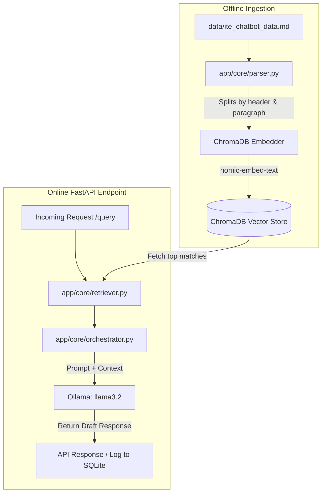

# ITE Ticket & Email Copilot — Guide

This repository contains the AI-powered backend for the **ITE Ticket & Email Copilot**. This system helps administrative staff at the Institute of Technical Education (ITE) Singapore draft professional, accurate, and policy-grounded email and ticket responses to student and stakeholder inquiries.

The backend leverages a local **Retrieval-Augmented Generation (RAG)** architecture using a local LLM and vector database to ensure generated drafts are grounded strictly in official documentation (e.g., student handbooks, academic calendars, and policy guides).

---

##  Key Concepts

Before dive-building the system, it is helpful to understand the underlying technical concepts:

*   **FastAPI**: A modern, high-performance web framework for Python. It parses incoming JSON requests, validates parameters using Pydantic, and generates interactive Swagger documentation automatically at `/docs`.
*   **Retrieval-Augmented Generation (RAG)**: Standard Large Language Models (LLMs) are trained on general web public data and do not know internal ITE policies. Instead of expensive retraining (fine-tuning), RAG queries official policy documents matching a student's inquiry, inserts these excerpts as context in the prompt, and directs the local LLM to draft an email based *only* on that verified text.
*   **Embeddings**: A method of converting human text into a dense list of numbers (a vector representing semantic meaning). For example, *"How much is school fee?"* and *"Tuition cost"* generate vectors that are mathematically close, enabling search by meaning rather than exact word matches.
*   **Vector Database (ChromaDB)**: A database specialized in storing these embedding vectors. It calculates the cosine similarity (geometrical distance) between a query vector and the document vectors to find the most relevant chunks in milliseconds.
*   **Audit Trail & SQLite**: A local SQL database (`audit_log.db`) used to track AI drafts, human corrections, and ratings (Thumbs Up/Down). This ensures transparency and provides training feedback data.

---

##  System Architecture

The application handles three distinct data flows:
1.  **Offline Ingestion & Indexing Pipeline**: Slice raw handbook files, generate embeddings, and store them in ChromaDB.
2.  **Online RAG Draft Generation API**: Accept questions, query matching context from ChromaDB, invoke the LLM, log in SQLite, and return a draft.
3.  **Background Email Polling (IMAP/SMTP)**: A background thread that regularly fetches new emails, automatically runs RAG to log draft responses, and allows admins to reply on-demand.



---

##  Project Directory Structure

```text
PROJECTFOLDER/
│
├── app/
│   ├── main.py                     # FastAPI entry point. Mounts version routers & static UI folder.
│   ├── config.py                   # Loads environment variables (.env) using Pydantic Settings.
│   │
│   ├── api/
│   │   ├── router.py               # Root API router (maps prefix /api).
│   │   └── v1/
│   │       ├── router.py           # v1 API router (groups health, query, and audit endpoints).
│   │       └── endpoints/
│   │           ├── health.py       # Basic API heartbeat status endpoint.
│   │           ├── query.py        # Runs the RAG pipeline to generate response drafts.
│   │           └── audit.py        # Logs admin actions, corrections, and feedback to SQLite.
│   │
│   └── core/
│       ├── parser.py               # Reads the raw markdown handbook and slices it into search chunks.
│       ├── embedder.py             # Generates vector embeddings and indexes chunks in ChromaDB.
│       ├── retriever.py            # Queries ChromaDB to find matching context for a question.
│       ├── orchestrator.py         # Formulates prompts and calls the Ollama llama3.2 model.
│       ├── audit.py                # Performs SQL insert/update operations on the SQLite database.
│       ├── email_worker.py         # Background worker thread that polls unread emails via IMAP.
│       └── email_sender.py         # Establishes secure SMTP connections to send out approved replies.
│
├── HTML/                           # Frontend Dashboard UI Assets
│   ├── index.html                  # Core HTML structure.
│   ├── script.js                   # Application state, interactive layout rendering, and API calls.
│   └── styles.css                  # UI theme styles (featuring custom glassmorphism & dark mode).
│
├── data/
│   ├── ite_chatbot_data.md         # The main scraped database of ITE policies, calendars, and FAQs.
│   ├── ite_chatbot_data_test.md    # A smaller sample file used for running chunking unit tests.
│   └── chroma_db/                  # Persistent directory storing HNSW vector indexes.
│
├── tests/
│   ├── test_parser.py              # Validates that the chunker parses text without formatting/boundary errors.
│   ├── test_retriever.py           # Asserts semantic retrieval relevance for sample test queries.
│   ├── test_api.py                 # Tests CRUD and lifecycle endpoints (/health, /query, /audit).
│   └── test_integration_live.py    # Performs a live e2e integration test calling Ollama.
│
├── .env                            # App environment configurations (port keys, debug flags, email credentials).
├── requirements.txt                # Lists the Python packages required to run the project.
└── README.md                       # Developer guides and onboarding instructions (this file).
```

---

##  Environment Setup & Installation

Follow these steps sequentially to set up your local development environment:

### Step 1: System Prerequisites
Before setting up the project, make sure the following software is installed on your machine:
1.  **Python 3.12 or 3.13 (Recommended)**: The application has been tested and operates stably on Python 3.12 and Python 3.13.
2.  **Ollama**: Used to run local open-source LLMs and embedding models.
3.  **Git**: Used for version control.

---

### Step 2: Create a Virtual Environment
It is highly recommended to isolate your project dependencies using a virtual environment. You can use either Python's standard `venv` or a `conda` environment.

#### Option A: Using Standard Python `venv` (Vanilla Setup)
1.  Open your terminal in the project root directory.
2.  Create the virtual environment:
    ```bash
    python -m venv .venv
    ```
3.  Activate the virtual environment:
    *   **Windows (PowerShell)**:
        ```powershell
        .\.venv\Scripts\Activate.ps1
        ```
    *   **Windows (CMD)**:
        ```cmd
        .\.venv\Scripts\activate.bat
        ```
    *   **macOS / Linux**:
        ```bash
        source .venv/bin/activate
        ```

#### Option B: Using Miniconda or Anaconda
1.  Open your terminal shell (e.g., PowerShell on Windows or Terminal on macOS/Linux).
2.  Create the conda environment:
    ```bash
    conda create -n ite_copilot python=3.12 -y
    ```
3.  Activate the environment:
    ```bash
    conda activate ite_copilot
    ```

---

### Step 3: Install Packages & Dependencies
Ensure your virtual environment is active and upgrade `pip`:
```bash
python -m pip install --upgrade pip
```

Install the project dependencies defined in [requirements.txt](file:///c:/Users/ianon/ITE%20PROJECT/PROJECTFOLDER/requirements.txt):
```bash
pip install -r requirements.txt
```

#### Why These Packages Are Required:
*   **`fastapi`**: A high-performance web framework used to expose our RAG query and audit log endpoints.
*   **`uvicorn`**: The ASGI web server used to run the FastAPI application.
*   **`pydantic`**: Used for data parsing, structured definitions, and strict validation of request/response payloads.
*   **`pydantic-settings`**: Automatically parses settings from system environment variables and `.env` files into a strongly typed Python configurations object.
*   **`python-dotenv`**: Reads key-value pairs from a `.env` file and sets them as environment variables.
*   **`chromadb`**: A fast, local vector database engine that indexes text embeddings and supports semantic search metadata filters.
*   **`ollama`**: Standard python package for communicating with the local Ollama LLM and embedding server.
*   **`pytest`**: Python testing framework for running unit and integration tests.

---

## ⚙️ Step-by-Step Build Instructions

Follow these instructions to configure environment variables, run local models, and build the search database:

### Step 1: Configure Environment Variables (`.env`)
The application relies on configuration options loaded from a `.env` file. 

1.  Copy the example configuration file in the project root to create a `.env` file:
    *   **Windows (PowerShell)**:
        ```powershell
        Copy-Item .env.example .env
        ```
    *   **macOS / Linux / Windows (Git Bash)**:
        ```bash
        cp .env.example .env
        ```
2.  Open the newly created `.env` file and configure the variables:
    ```env
    # Application Configuration
    APP_NAME="ITE Ticket & Email Copilot"
    APP_ENV="development"
    DEBUG=true
    HOST="127.0.0.1"
    PORT=8000

    # Live Email Integration Settings (Optional)
    # If left blank, the background worker will skip mail polling gracefully.
    EMAIL_IMAP_SERVER="outlook.office365.com"
    EMAIL_SMTP_SERVER="smtp.office365.com"
    EMAIL_IMAP_PORT=993
    EMAIL_SMTP_PORT=587
    EMAIL_ADDRESS="your-email@example.com"
    EMAIL_PASSWORD="your-app-specific-password"
    EMAIL_CHECK_INTERVAL=30
    ```

    > [!NOTE]
    > If email configurations are left blank or credentials are not valid, the background email worker thread will gracefully log a warning and skip connections, allowing the rest of the application to run normally.

---

### Step 2: Set Up and Run Ollama
The RAG pipeline requires local embedding and language models.
1.  Download and install Ollama from [Ollama's Official Website](https://ollama.com/).
2.  Launch the Ollama desktop application (ensure it is running in your system tray).
3.  Open a terminal window and pull the required models:
    ```bash
    # nomic-embed-text (used for creating 768-dimensional text embedding vectors)
    ollama pull nomic-embed-text

    # llama3.2 (the default 3B parameters LLM for email draft response generation)
    ollama pull llama3.2
    ```

---

### Step 3: Populate the Vector Database (Build Step)
Before running the server, you must compile and build the semantic knowledge base by parsing the raw markdown handbook, generating embeddings, and saving them to ChromaDB.

Run the document embedding builder script:
```bash
python -m app.core.embedder
```

*What this script does:*
1.  Reads the official policies and guidelines from [ite_chatbot_data.md](file:///c:/Users/ianon/ITE%20PROJECT/PROJECTFOLDER/data/ite_chatbot_data.md).
2.  Uses the chunking engine in [parser.py](file:///c:/Users/ianon/ITE%20PROJECT/PROJECTFOLDER/app/core/parser.py) to split the document by headers and paragraphs into search-optimized units (under 800 characters).
3.  Contacts the local Ollama instance to generate vector embeddings using `nomic-embed-text`.
4.  Stores the embeddings and associated metadata into the persistent vector database directory under `data/chroma_db/`.

*Expected Successful Output:*
```text
[Parser] Parsing c:\Users\ianon\ITE PROJECT\PROJECTFOLDER\data\ite_chatbot_data.md...
[Parser] Generated 142 document chunks.
[Embedder] Connecting to ChromaDB client...
[Embedder] Generating embeddings and indexing chunks...
[Embedder] Database successfully initialized with 142 indexed documents.
```

---

### Step 4: Database Initialization (Audit Logs)
You do not need to manually initialize the SQLite audit log database. The application code in [audit.py](file:///c:/Users/ianon/ITE%20PROJECT/PROJECTFOLDER/app/core/audit.py) will automatically create `data/audit_log.db` and set up the `audit_logs` table schema upon the first application run or query action.

---

### Step 5: Start the FastAPI Application Server
With the virtual environment active, dependencies installed, models pulled, and ChromaDB built, start the local development server:
```bash
python -m uvicorn app.main:app --host 127.0.0.1 --port 8000 --reload
```

---

### Step 6: Verify and Interact with the Project
Once the development server is running, verify the setup by visiting these endpoints:
1.  **Web Dashboard UI**: Open [http://127.0.0.1:8000/](http://127.0.0.1:8000/) in your web browser. This redirects to `/ui/index.html`, where you can test the ticket editor, RAG drafts, and feedback loop.
2.  **Interactive Swagger API Docs**: Open [http://127.0.0.1:8000/docs](http://127.0.0.1:8000/docs) to test and run API endpoints manually.
3.  **Heartbeat Health Check**: Navigate to [http://127.0.0.1:8000/api/v1/health](http://127.0.0.1:8000/api/v1/health) to verify system connection health.

---

##  Verification & Testing

Verify that all modules are working correctly by executing our automated test suites:

```bash
# Run all unit and integration tests
pytest
```

If you wish to run specific tests:
*   **Test Text Chunking & Parsing**:
    ```bash
    python -m tests.test_parser
    ```
*   **Test API Endpoints & Database Lifecycle**:
    ```bash
    python -m tests.test_api
    ```
*   **Test Live E2E RAG Pipeline**:
    ```bash
    pytest tests/test_integration_live.py
    ```

---

